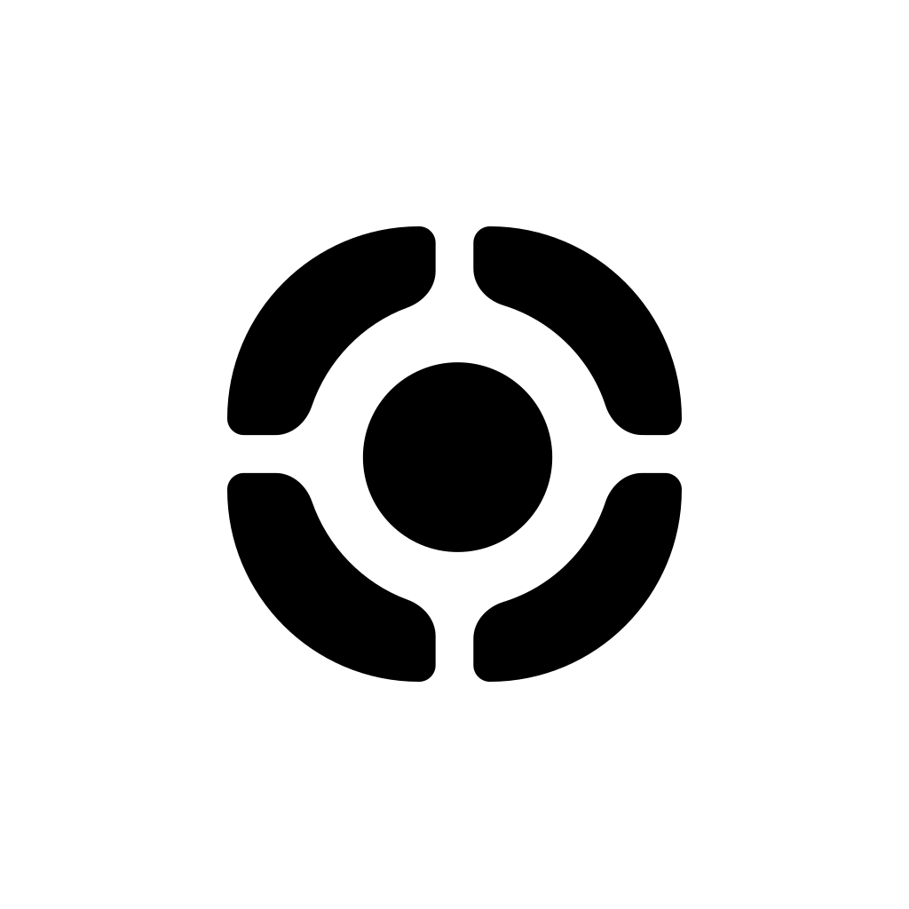
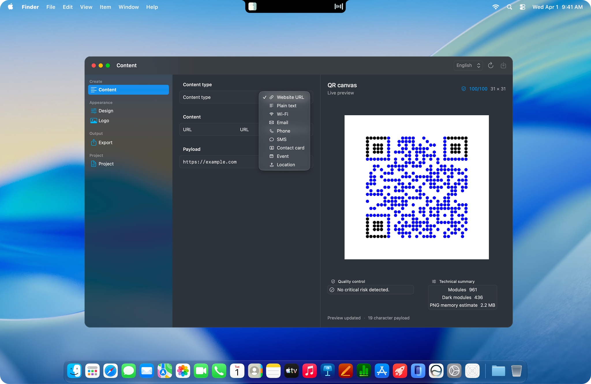
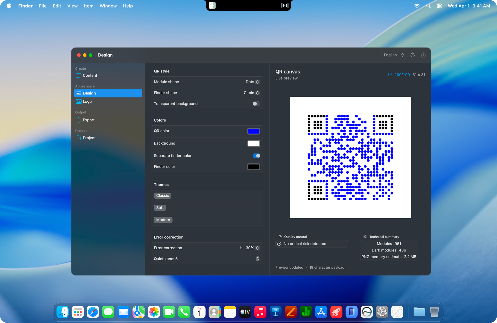

<div align="center">
  

  <h1>qevorn - Native QR Studio for macOS</h1>

  <p>Create, style, validate, and export QR codes with a focused SwiftUI experience built entirely for macOS.</p>

  <p>
    
    
    
    
    
  </p>

  <p>
    <a href="#install">
      
    </a>
  </p>
</div>

<hr>

## Overview

qevorn is a native QR code studio for macOS. It keeps QR generation, rendering, decode checks, exports, and project files on the Mac. The app is written in Swift and SwiftUI, with AppKit and Apple graphics frameworks used where native macOS integration matters.

Create a QR code from a URL, plain text, Wi-Fi credentials, contact details, an event, a location, and more. Then adjust its visual treatment, verify that it decodes, and export exactly the formats and sizes you need.

## Screenshots

<p align="center">
  <strong>Content workspace</strong>
</p>

<p align="center">
  
</p>

<br>

<p align="center">
  <strong>Design workspace</strong>
</p>

<p align="center">
  
</p>

## Highlights

<table>
  <tr>
    <td width="50%">
      <strong>QR content types</strong><br>
      Build codes for URLs, text, Wi-Fi, email, phone, SMS, vCards, calendar events, and locations.
    </td>
    <td width="50%">
      <strong>Live quality feedback</strong><br>
      See the result immediately, review density and contrast warnings, and run a native decode check before export.
    </td>
  </tr>
  <tr>
    <td>
      <strong>Visual control</strong><br>
      Set module and finder shapes, colors, quiet zone, transparent backgrounds, error correction, and quick design presets.
    </td>
    <td>
      <strong>Brand-safe logos</strong><br>
      Add a center logo and tune its scale, padding, card color, corner radius, and circular presentation.
    </td>
  </tr>
  <tr>
    <td>
      <strong>Flexible exports</strong><br>
      Export PNG, JPEG, SVG, or PDF at preset resolutions from 256 px to 8192 px, or add a custom size.
    </td>
    <td>
      <strong>Batch and project workflow</strong><br>
      Generate a CSV batch, then save or reopen all content and styling choices as a JSON project.
    </td>
  </tr>
  <tr>
    <td>
      <strong>Mac-native interface</strong><br>
      Native toolbars, file dialogs, save panels, dark appearance support, and a Dock icon that follows the active appearance.
    </td>
    <td>
      <strong>Localized interface</strong><br>
      English, Turkish, German, Spanish, Danish, Norwegian, Italian, and Russian are included.
    </td>
  </tr>
</table>

## Requirements

- macOS 14 Sonoma or later
- Xcode Command Line Tools for source builds

qevorn does not use a web view, a remote API, a server, or a third-party runtime. WebP is intentionally not offered as an export format.

## Install

### DMG

Open [`qevorn-v1.0.0.dmg`](dist/qevorn-v1.0.0.dmg), then drag **qevorn.app** into **Applications**.

The DMG build script signs the app and disk image with an available Developer ID Application certificate. Notarize and staple the DMG before public distribution.

### Build from source

```sh
git clone <your-repository-url>
cd qevorn
swift run
```

To create a local application bundle:

```sh
./scripts/build-app.sh
open dist/qevorn.app
```

## Using qevorn

1. Choose a content type from the sidebar and enter its data.
2. Open **Design** to adjust QR appearance and error correction.
3. Optionally add a center logo.
4. Review the live preview and run the QR decode test.
5. Open **Export**, select a format and output sizes, then choose a destination folder.

For multiple codes, import a CSV file with `name,payload` columns. qevorn also accepts a single first column as the payload. Use the **Project** section to save a reusable JSON project or reopen an existing one.

## Architecture

qevorn is a Swift Package with a compact native macOS application target:

```text
Sources/Qevorn/
├── QevornApp.swift                 Application lifecycle and window setup
├── StudioView.swift                SwiftUI workspace, controls, import and export flows
├── StudioModel.swift               QR content and project-state models
├── QRRenderingEngine.swift         QR matrix generation, drawing, decode checks, and exports
├── DisplayNames.swift              User-facing labels for model values
├── AppLocalization.swift           Interface localization catalog
└── ApplicationIconAppearance.swift Appearance-aware Dock icon handling

Resources/
└── Branding/                       qevorn light and dark logo sources
```

The QR matrix comes from Apple's Core Image QR generator. Rendering and image encoding use Core Graphics and ImageIO; PDF export uses PDFKit; application integration and image handling use AppKit.

## Development

Build the release app and verify its local code signature:

```sh
./scripts/build-app.sh
codesign --verify --deep --strict --verbose=2 dist/qevorn.app
```

Create the versioned DMG:

```sh
./scripts/create-dmg.sh
```

The script rebuilds `qevorn.app`, creates `dist/qevorn-v1.0.0.dmg`, and verifies the disk image.

## Project

qevorn is designed as a focused, private, Mac-native QR workflow.
